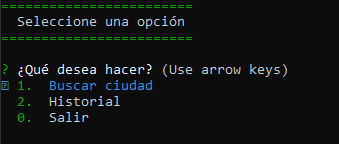
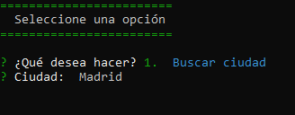
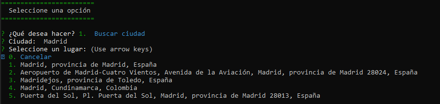
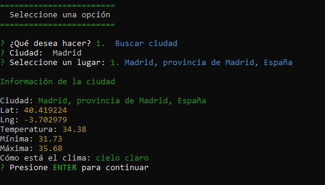
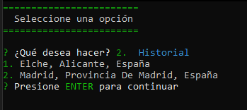

# 🌤️ Búsqueda de Ciudades - Información Meteorológica


### 📝 Descripción

<a name="descripción"></a>

Esta es una aplicación de consola desarrollada en Node.js que permite buscar información meteorológica de diferentes ciudades. Utiliza APIs de terceros para obtener los datos meteorológicos y guarda un historial de las búsquedas realizadas.

### 🌟 Características

<a name="características"></a>

- 🔍 **Buscar información meteorológica de cualquier ciudad**
- 🗂️ **Guardar el historial de búsquedas**
- 📋 **Listar el historial de búsquedas**
- 💾 **Guardar y cargar el historial desde un archivo JSON para persistencia**

### 📦 Dependencias

<a name="dependencias"></a>

- [axios](https://www.npmjs.com/package/axios): Para realizar solicitudes HTTP a las APIs de meteorología.
- [yargs](https://www.npmjs.com/package/yargs): Para manejar los argumentos de la línea de comandos.
- [colors](https://www.npmjs.com/package/colors): Para agregar colores a la salida en la consola.
- [dotenv](https://www.npmjs.com/package/dotenv): Para cargar las variables de entorno desde un archivo `.env`.

### 🛠️ Instalación

<a name="instalación"></a>

1. Clona el repositorio:
    ```bash
    git clone https://github.com/JhonyCode/Node-clima-app.git
    ```

2. Navega al directorio del proyecto:
    ```bash
    cd Node-clima-app
    ```

3. Instala las dependencias:
    ```bash
    npm install
    ```

### 🔧 Configuración

<a name="configuración"></a>

1. Crea un archivo `.env` en el directorio raíz del proyecto.

2. Añade tus claves de API de [Mapbox](https://www.mapbox.com/) y [OpenWeatherMap](https://openweathermap.org/) al archivo `.env`:
    ```env
    MAPBOX_KEY=tu_api_key_de_mapbox
    OPENWEATHER_KEY=tu_api_key_de_openweathermap
    ```

### 🚀 Uso

<a name="uso"></a>

Para iniciar la aplicación, ejecuta el siguiente comando:
```bash
node app.js
```

### 📷 Capturas de pantalla de la aplicación 







